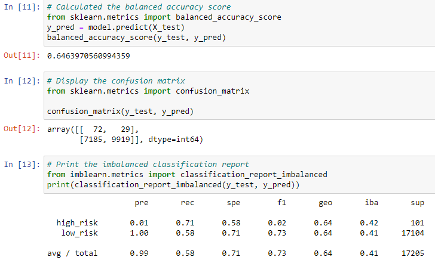
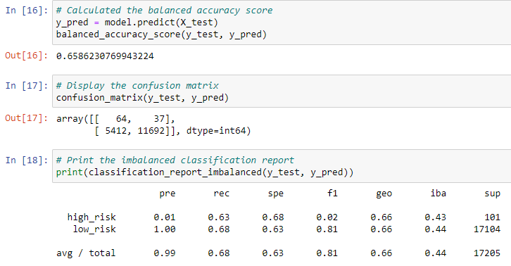
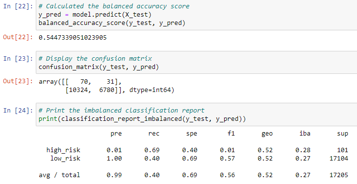
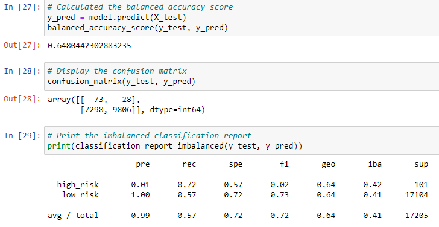
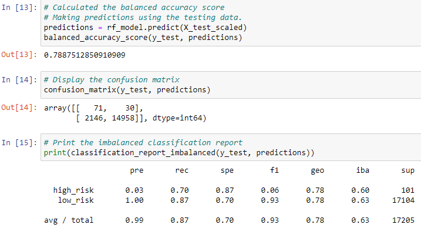
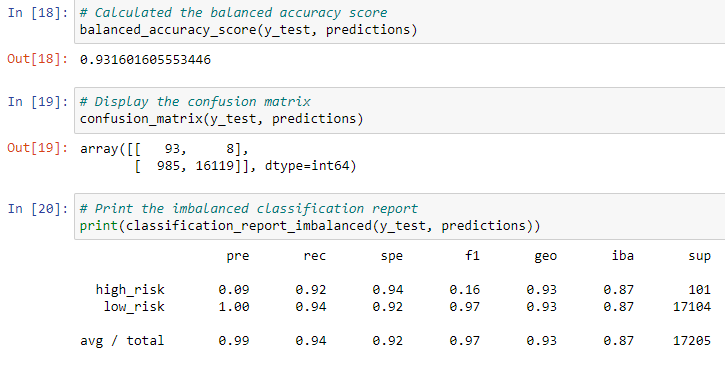

# Credit Risk Analysis
## Overview of the Analysis
Given a data set of loan stats from Q1 of 2019, I am seeking to build machine learning models that can predict the target "loan_status" when provided with features of loan stats. Since the loan_status data is skewed with significantly more low risk statuses than high risk, I am creating a variety of models that utilize oversampling, undersampling, and ensemble classifiers to make predictions more accurate. 
### Purpose
The purpose of this analysis is to compare the predictive power of the various machine learning models to determine how well they predict credit risk. The criteria for predictive power will be based on their accuracy scores, precision scores, and recall (or sensitivity) scores, while also taking into consideration the nature of credit risk in banking.
## Results
### Score Results
- **Balanced Accuracy Scores:** naive random oversampling - 0.646, SMOTE oversampling - 0.659, ClustersCentroid - 0.545, SMOTEEN - 0.648, BalancedRandomForests ensemble - 0.789, EasyEnsemble - 0.932
- **Precision:** naive random oversampling - high risk: 0.01, low risk: 1.00; SMOTE oversampling - high risk: 0.01, low risk: 1.00; ClustersCentroid - high risk: 0.01, low risk: 1.00; SMOTEEN - high risk: 0.01, low risk: 1.00; BalancedRandomForests ensemble - high risk: 0.03, low risk: 1.00; EasyEnsemble - high risk: 0.09, low risk: 1.00
- **Recall Scores:** naive random oversampling - high risk: 0.71, low risk: 0.58; SMOTE oversampling - high risk: 0.36, low risk: 0.68; ClustersCentroid - high risk: 0.69, low risk: 0.40; SMOTEEN - high risk: 0.72, low risk: 0.57; BalancedRandomForests ensemble - high risk: 0.70, low risk: 0.87; EasyEnsemble - high risk: 0.92, low risk: 0.94

### Score Overview
**Naive Random Oversampling:**

  
**SMOTE Oversampling:** 

**ClustersCentroid Undersampling:** 

  
**SMOTEEN:** 

**BalancedRandomForestEnsemble:** 

 

**EasyEnsemble:** 

## Summary
The balanced accuracy scores of the models showed that both oversampling models as well as the SMOTEEN over-under sampling model preformed similarly, the ClusterCentroids undersampling models scored lower, and the two ensemble models performed the best. All of the models had similar precision scores, with a small prediction score for high risk loans and a high prediction score for low risk loans. Again, the ensemble models performed better than the other models, being the only models with a prediction score for high risk loans higher than 0.01. With regard to the recall scores, the undersampling model again performed poorly, while the ensemble models performed the best. Most of the models seemed to be more sensitive to high risk loans; only the BalancedRandomForests ensemble model had a significantly higher sensitivity to low risk loans, while the SMOTE oversampling and EasyEnsemble models had balanced scores and the other models favored sensitivity to high risk loans.
### Recommended Model
I would recommend the EasyEnsemble model for predicting credit risk. It has the highest scores across the board and none of the other models out-perform it in any way.
